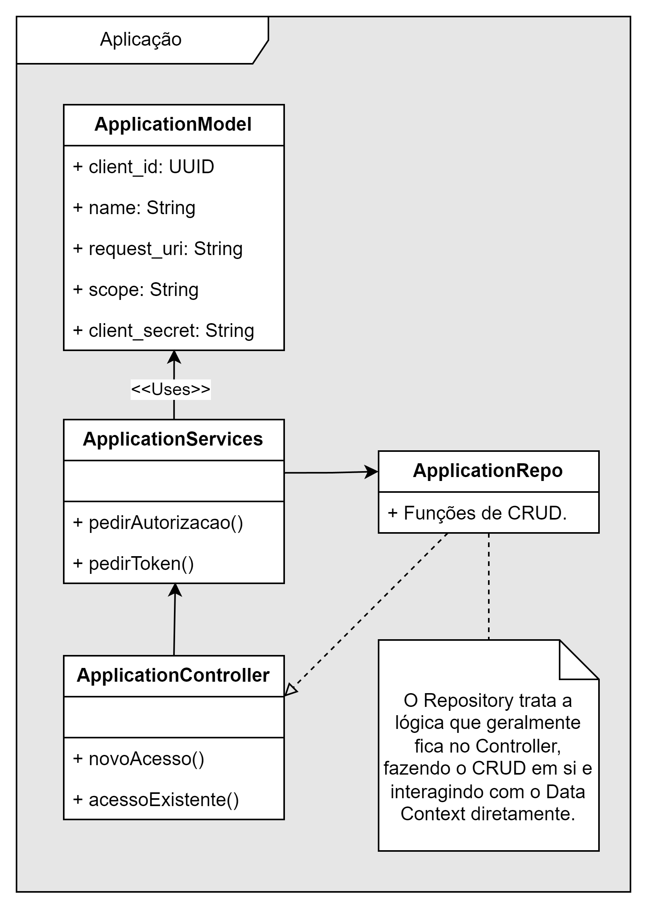

# OAuth 2.0 Auth Project - Prisma + Fastfy

[![Prisma][prisma-img]][prisma] [![Fastify][fastify-img]][fastify]

## Description

This project is an Authorization Server designed to provide robust and secure authentication mechanisms. Built using the
Fastify framework and Prisma ORM, it offers a high-performance and scalable solution for managing authentication flows.

* **Fastify Framework**: Utilizing Fastify's lightweight and efficient architecture to ensure quick server responses and
  easy route management.
* **Prisma ORM Integration**: Leverages Prisma for seamless database interactions, ensuring reliable and maintainable
  data access.
* **OAuth 2.0 and OpenID Connect**: Implements standard protocols like OAuth 2.0 and OpenID Connect to provide a
  versatile and secure authentication system.
* **Scalable Architecture**: Designed with scalability in mind, capable of handling large numbers of authentication
  requests with minimal latency.
* **Developer-Friendly Design**: Offers a well-documented and straightforward setup process, allowing developers to
  integrate the server into their applications with ease.
* **Customizable and Extendable**: Provides the flexibility to be customized and extended according to specific
  authentication needs and requirements.

Our Authorization Server is not just about securely managing access; it's about providing a seamless and efficient
authentication experience for both developers and end-users.

---

## Project Architecture Overview

With **[DrawIO]** we made a Architecture Diagram to represent what our software structure looks like.

<p align="center">
  
</p>


With `Our Software`, you can easily implement a Authorization Server on your structure, to improve security and workflow at your company.

## Who Are We?

<p align="center">
  
  
</p>

---

[GitHub action]: https://github.com/andresz1/size-limit-action
[Statoscope]:    https://github.com/statoscope/statoscope
[prisma-img]:    https://ziadoua.github.io/m3-Markdown-Badges/badges/Prisma/prisma1.svg
[prisma]:        https://www.prisma.io/
[fastify-img]:   https://img.shields.io/badge/fastify-%23000000.svg?style=for-the-badge&logo=fastify&logoColor=white
[fastify]:      https://www.fastify.io/

## Who Uses this Authorization Workflow

* [Spotify](https://open.spotify.com/)
* [Google](https://google.com)
* [Blizzard](https://www.blizzard.com/pt-br/)

And many others.

## How It Works

1. Our Authorization Server is built on the Fastify framework and integrates Prisma ORM, creating a streamlined and efficient authentication process.
    - **Route Handling and Middleware Integration**: Fastify's powerful routing and middleware capabilities allow for the efficient management of authentication requests.
    - **Database Management with Prisma**: Prisma ORM is used to handle database operations, ensuring secure and reliable data storage and retrieval.
2. The server implements OAuth 2.0 and OpenID Connect protocols, providing a versatile platform for managing various authentication flows.
    - **Token Generation and Validation**: Generates secure access tokens and refresh tokens, and validates them to ensure secure access to resources.
    - **User Authentication**: Manages user credentials and session information, providing a secure and seamless user authentication experience.
3. The server is designed with extensibility in mind, allowing for easy integration of additional authentication mechanisms or updates to existing protocols.
    - **Modular Design**: Easily add new authentication methods or update existing ones without impacting the overall system architecture.
4. Performance and Scalability: Utilizes Fastify's high performance and low overhead to ensure that the server can handle a high volume of authentication requests efficiently.
    - **Scalable Architecture**: Capable of scaling to meet the demands of large-scale applications and user bases.
5. Developer-Friendly Setup: The server is designed to be easily set up and integrated into existing systems, with comprehensive documentation and support for quick implementation.
    - **Documentation and Community Support**: Provides detailed documentation and access to a community of developers for troubleshooting and best practices.

## Usage

This Authorization Server is ideal for applications requiring robust and secure user authentication. It's suitable for a wide range of applications, from small microservices to large-scale enterprise systems.

- **Setup and Configuration**: Instructions on setting up the server and configuring it for your specific application needs.
- **Integration with Front-End Applications**: Guidelines on how to integrate the server with various front-end frameworks and platforms.
- **Customizing Authentication Flows**: Steps to customize the authentication flows to cater to the unique requirements of your application.
- **Monitoring and Maintenance**: Best practices for monitoring the server's performance and ensuring its ongoing maintenance and security.

### Instructions (Click to Expand)

<details><summary><b>Show instructions for Installing and Running the Project</b></summary>

1. **Clone the Repository**:

   Primeiro, clone o repositório do projeto para sua máquina local usando Git.

    ```sh
    git clone [URL do seu repositório]
    cd [nome do diretório do projeto]
    ```

2. **Instalar Dependências**:

   Instale todas as dependências necessárias, incluindo Fastify e Prisma, usando npm.

    ```sh
    npm install
    ```

3. **Adicionar Configurações ao `package.json`**:

   Certifique-se de que seu `package.json` inclua as versões corretas do TypeScript, Fastify e Prisma.

    ```json
    {
      "name": "your-auth-server",
      "version": "1.0.0",
      "scripts": {
        "start": "node src/app.js",
        "prisma": "prisma"
      },
      "dependencies": {
        "fastify": "^3.0.0",
        "prisma": "^2.0.0"
      },
      "devDependencies": {
        "typescript": "^4.0.0"
      }
    }
    ```

4. **Configuração do Prisma**:

   Configure seu schema do Prisma (`prisma/schema.prisma`). Por exemplo:

    ```prisma
    datasource db {
      provider = "postgresql"
      url      = env("DATABASE_URL")
    }

    generator client {
      provider = "prisma-client-js"
    }

    model User {
      id    Int    @id @default(autoincrement())
      name  String
      email String @unique
    }
    ```

5. **Executar Migrações do Prisma**:

   Execute as migrações do Prisma para atualizar seu banco de dados.

    ```sh
    npx prisma migrate dev --name init
    ```

6. **Iniciar o Servidor**:

   Inicie o servidor Fastify.

    ```sh
    npm start
    ```

   Isso iniciará o servidor de autenticação na porta especificada em seu arquivo de configuração.

7. **Testar a Aplicação**:

   Teste o servidor acessando os endpoints definidos em seu projeto através de um cliente HTTP, como Postman ou curl.

</details>

---

## You may also like...

- [Spotify Widget](https://github.com/HorselessName/spotify-widget) - A Spotify Widget for Embed HTML on Third Party Sites
- [PocketPay](https://github.com/entr0pie/PocketPay-Angular) - A Banking Software to be used as a Base for Banking Apps

## License

MIT
